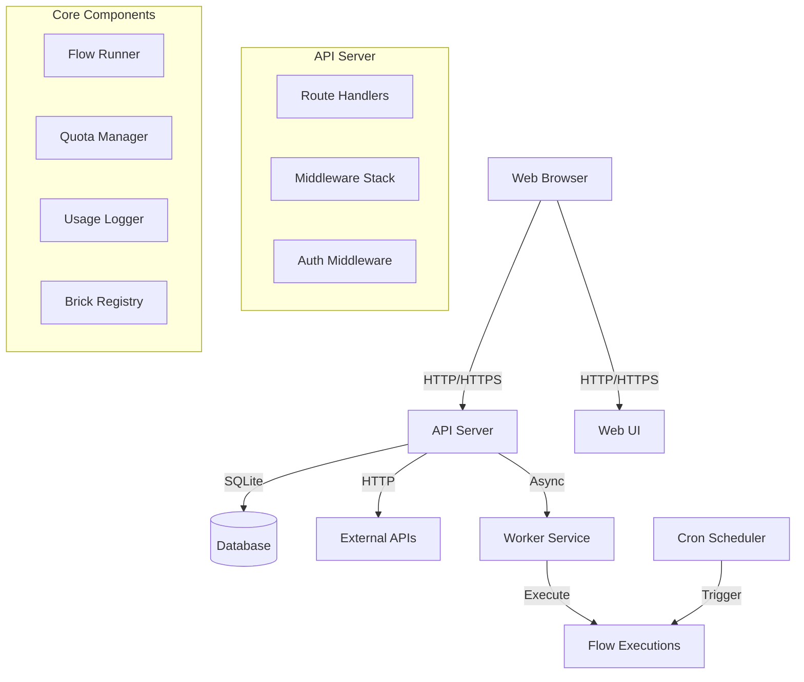
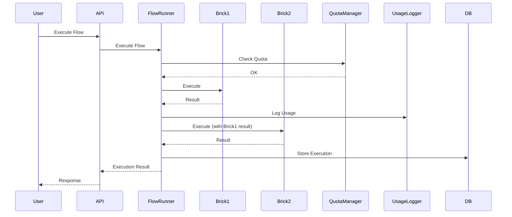

# FlowMason Architecture

## Overview

FlowMason is a visual automation platform built with Rust for the backend and React/TypeScript for the frontend. It enables users to create automated workflows by connecting different services and APIs together.

## System Architecture

## Component Overview

### Backend (Rust)

#### API Server (`services/api`)
- **Framework**: Axum web framework
- **Port**: 3000 (default)
- **Responsibilities**:
  - HTTP request handling
  - Authentication & authorization
  - Flow CRUD operations
  - Execution management
  - Usage tracking

#### Core Library (`crates/core`)
- **Flow Runner**: Executes flows by running bricks sequentially
- **Quota Manager**: Tracks and enforces usage limits
- **Mapper**: Transforms data between formats
- **Rules Engine**: Evaluates conditional logic

#### Bricks (`crates/bricks`)
- **Integration Bricks**: OpenAI, NVIDIA, HubSpot, Notion, Odoo, n8n
- **Processing Bricks**: Field Mapping, Combine Text, Conditional

#### Database (`crates/db`)
- **Database**: SQLite
- **Repositories**: Data access layer for all entities
- **Migrations**: Schema versioning

#### Scheduler (`crates/scheduler`)
- **Cron Executor**: Runs scheduled flows
- **Job Management**: Manages scheduled flow executions

#### Authentication (`crates/auth`)
- **JWT**: Token-based authentication
- **API Keys**: Long-lived authentication tokens
- **Middleware**: Request authentication

### Frontend (React/TypeScript)

#### Web UI (`services/web-ui-vite`)
- **Framework**: React + Vite
- **Port**: 8080 (dev), served by API (prod)
- **Features**:
  - Visual flow builder
  - Flow management
  - Execution history
  - Usage monitoring
  - Template library

## Data Flow

### Flow Execution Flow

## Database Schema

### Core Tables

- **flows**: Flow definitions
- **executions**: Execution history
- **execution_data**: Per-brick execution data
- **usage_logs**: Usage tracking
- **quotas**: Quota limits and usage
- **users**: User accounts
- **api_keys**: API key management
- **scheduled_flows**: Scheduled flow configurations
- **templates**: Flow templates
- **audit_logs**: Security audit trail

## Security Architecture

### Authentication
- JWT tokens for user sessions
- API keys for programmatic access
- Password hashing with bcrypt

### Authorization
- Middleware-based authentication
- Per-endpoint authorization checks
- User context in request extensions

### Input Validation
- Webhook URL validation
- Cron expression validation
- Email format validation
- JSON schema validation

### Audit Logging
- Sensitive operation tracking
- User action logging
- IP address tracking

## Performance Considerations

### Concurrency
- Async/await throughout
- Connection pooling for database
- HTTP client connection reuse

### Caching
- In-memory job queue
- HTTP client connection pooling

### Scalability
- Stateless API design
- Horizontal scaling ready
- Background job processing

## Deployment Architecture

### Development
- Single binary for API server
- Separate dev server for Web UI
- SQLite database file

### Production
- Docker containerization
- Health check endpoints
- Database backups
- Log aggregation ready

## Error Handling

### Error Types
- **BrickError**: Brick execution failures
- **QuotaError**: Quota limit exceeded
- **FlowError**: Flow execution errors
- **ApiError**: API-level errors

### Error Recovery
- Automatic retries with exponential backoff
- Dead letter queue for failed executions
- Error logging and tracking

## Monitoring & Observability

### Logging
- Structured logging with tracing
- Request ID tracking
- Log levels (debug, info, warn, error)

### Health Checks
- `/health` endpoint
- Database connectivity checks

### Metrics
- Request latency tracking
- Error rate monitoring
- Usage statistics
